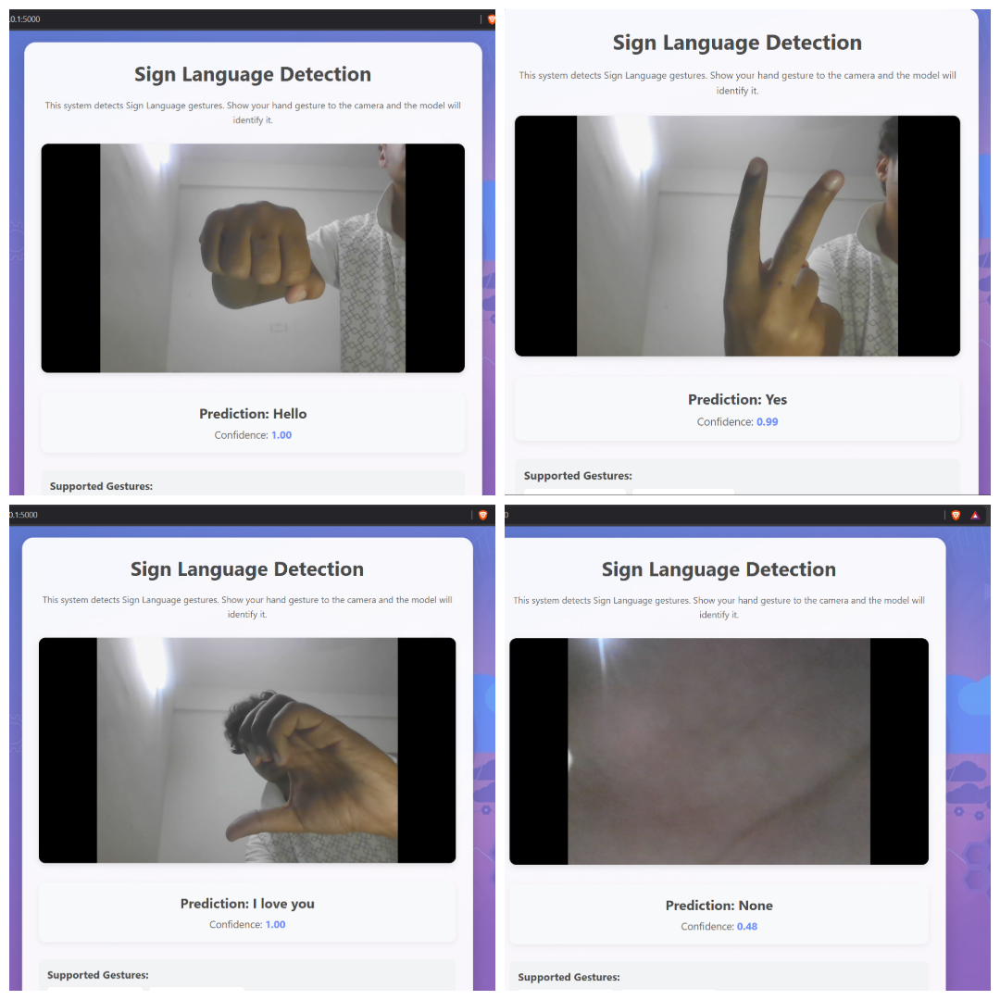

# 🤟 Real-Time Sign Language Recognition Using Machine Learning


A computer vision and deep learning project that recognizes hand signs using a trained TensorFlow/Keras image classification model. The project uses OpenCV for image and camera processing and a pre-trained Keras model for recognizing different hand-sign classes.
---

## Table of Contents

- [Project Overview](#project-overview)
- [Features](#features)
- [How It Works](#how-it-works)
- [Project Demo](#project-demo)
- [Technologies Used](#technologies-used)
- [Project Structure](#project-structure)
- [Installations](#installations)
- [Future Improvements](#future-improvements)
- [Contributions](#contributions)
- [Author](#author)

---

## Project Overview

This project uses computer vision and deep learning to recognize hand signs from images or a camera feed.

A trained TensorFlow/Keras model is used to classify the input image into one of the available hand-sign categories.

The main components of the project are:

- `keras_model.h5` — trained machine learning model
- `labels.txt` — class labels
- `dataCollection.py` — data collection script
- `test.py` — testing script
- `versiontest.py` — version/testing utility

---

## Features

- Hand-sign image classification
- Real-time camera-based recognition
- TensorFlow/Keras deep learning model
- OpenCV image processing
- Custom image data collection
- Pre-trained model included
- Class labels stored separately

---

## How It Works

The project follows this basic workflow:

```text
Camera / Image
      ↓
OpenCV
      ↓
Image Preprocessing
      ↓
TensorFlow / Keras Model
      ↓
Prediction
      ↓
Class Label
      ↓
Recognized Hand Sign
---
```
## 📸 Project Demo



---


## 🛠️ Technologies Used

* Python
* OpenCV
* CVZone
* TensorFlow / Keras
* NumPy
* Flask
* HTML/CSS

---

## 📂 Project Structure

```bash
Real-Time-Sign-Language-Recognition-Using-Machine-Learning/
│
├── static/
├── HandSign.png.png
├── README.md
├── app.py
├── dataCollection.py
├── keras_model.h5
├── labels.txt
├── test.py
└── versiontest.py
```

---

## ⚙️ Installation

### Clone the Repository

```bash
git clone https://github.com/Hellopapri/Real-Time-Sign-Language-Recognition-Using-Machine-Learning.git
```

### Navigate to the Project Directory

```bash
cd Real-Time-Sign-Language-Recognition-Using-Machine-Learning
```

### Create Virtual Environment

```bash
py -3.11 -m venv venv
```

### Activate The Environment

```bash
venv\Scripts\Activate.ps1
```

### Upgrade pip

```bash
python -m pip install --upgrade pip
```

### Install The Required Libraries

```bash
python -m pip install tensorflow opencv-python numpy pillow
```

### Run the Application

```bash
python app.py
```

---

## 🎯 Future Improvements

* Add more sign language gestures
* Improve model accuracy
* Voice output integration
* Sentence generation support
* Mobile application deployment

---

## 🤝 Contribution

Contributions are welcome!
Feel free to fork this repository and submit pull requests.

---

## 👩‍💻 Author

**Pranav Sanyal**
Data Analyst & AI Engineer

GitHub: https://github.com/pranav4141

---
